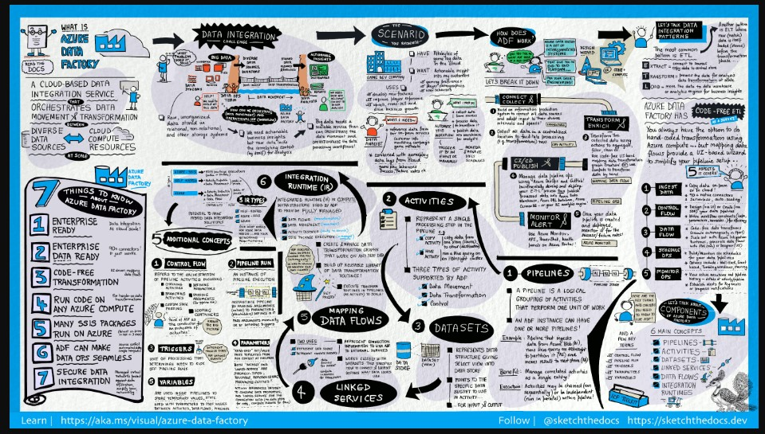

## ARM 
---
## Data Factory
    Data Factory contiene una serie de sistemas interconectados que proporcionan una plataforma completa de un extremo a otro para los ingenieros de datos.
    En Data Factory, una actividad define la acción que se realizará. Un servicio vinculado define un almacén de datos o un servicio de proceso de destino. Un entorno de ejecución de integración proporciona el puente entre la actividad y los servicios vinculados.
>Arquitectura

>ETL
 * Extracción, Carga y Transformación.
 

>Flow del servicio Data Factory:

### ¿Qué significa Orquestación?
    Para usar una analogía, piense en una orquesta sinfónica. El miembro principal de la orquesta es el director. El director no toca los instrumentos, simplemente dirige a los miembros de la orquesta a través de toda la pieza musical que interpretan. Los músicos usan sus propios conocimientos para generar sonidos concretos en distintas partes de la sinfonía, por lo que solo pueden aprender algunas partes de la pieza. El director dirige toda la pieza musical y, por lo tanto, es consciente de la partitura completa que se está tocando. También usará movimientos específicos con los brazos que proporcionen instrucciones a los músicos de cómo debe tocarse un fragmento musical.

    ADF puede usar un enfoque similar, mientras que tiene funcionalidad nativa para la ingesta y transformación de datos, a veces le indicará a otro servicio que realice el trabajo real necesario en su nombre, como Databricks para ejecutar una consulta de transformación. Por lo tanto, en este caso, sería Databricks quien realice el trabajo, no ADF. ADF simplemente organiza la ejecución de la consulta y, a continuación, proporciona las canalizaciones para trasladar los datos al siguiente paso o destino.

> Orquestacion&Conectores

>Conectar y recopilar
 
 Las empresas tienen datos de varios tipos que se encuentran en orígenes locales dispares, en la nube, `estructurados`, `no estructurados` y `semiestructurados`, que llegan todos según distintos intervalos y velocidades.

 * El primer paso en la creación de un `sistema de producción` de información es `conectarse` a todos los orígenes de datos y procesamiento necesarios.

     * Servicios de software como servicio `(SaaS)`.

     * Bases de datos.

     * Recursos compartidos de archivos y servicios web FTP.

    * El siguiente paso es mover los datos según sea necesario a una ubicación centralizada para su posterior procesamiento.
    
    > Actividad de Copia:
            
    * https://learn.microsoft.com/es-es/azure/data-factory/copy-activity-overview

        Canalización de datos para mover los datos desde almacenes de datos de origen locales y en la nube a un almacén de datos de centralización en la nube para su posterior análisis. Por ejemplo, puede recopilar datos de Azure Data Lake Storage y transformarlos posteriormente mediante un servicio de proceso de Azure Data Lake Analytics. También puede recopilar datos de Azure Blob Storage y transformarlos más adelante mediante un clúster de Azure HDInsight Hadoop.

         

    
>Transformar y enriquecer:

Cuando los datos están presentes en un almacén de datos centralizado en la nube, procese o transforme los datos recopilados mediante flujos de datos de asignación de `ADF`. Los flujos de datos permiten a los ingenieros de datos crear y mantener gráficos de transformación de datos que se ejecutan en Spark sin necesidad de comprender los clústeres de Spark o la programación de Spark.

Si prefiere codificar las transformaciones a mano, `ADF` admite actividades externas para ejecutar las transformaciones en servicios de proceso como `HDInsight Hadoop`, `Spark`, `Data Lake Analytics` y `Machine Learning`.

>CI/CD y publicación:

Data Factory ofrece compatibilidad total con CI/CD de sus canalizaciones de datos mediante Azure DevOps y GitHub. Esto le permite desarrollar y distribuir incrementalmente los procesos ETL antes de publicar el producto terminado. Después de refinar los datos sin procesar a un formato compatible listo para empresas, cargue los datos en Azure Data Warehouse, Azure SQL Database, Azure Cosmos DB o en cualquier motor de análisis al que puedan apuntar los usuarios mediante las herramientas de inteligencia empresarial.

>Supervisión:

Una vez creada e implementada correctamente la canalización de integración de datos, que proporciona un valor empresarial a partir de datos procesados, supervise las canalizaciones y las actividades programadas para ver las tasas de éxito y error. Azure Data Factory tiene compatibilidad integrada para la supervisión de canalizaciones mediante Azure Monitor, API, PowerShell, los registros de Azure Monitor y los paneles de mantenimiento de Azure Portal.

>Conceptos de nivel superior:

Una suscripción de Azure puede tener una o varias instancias de Azure Data Factory (o factorías de datos). Azure Data Factory consta de los siguientes componentes principales.

* Pipelines
* Actividades    
* Conjuntos de datos 
* Servicios vinculados  
* Flujos de datos
* Integration Runtime

Estos componentes funcionan juntos para proporcionar la plataforma en la que pueda crear flujos de trabajo basados en datos con pasos para moverlos y transformarlos.

>video

>Canalización:

Una factoría de datos puede tener una o más canalizaciones. La canalización es una agrupación lógica de actividades para realizar una unidad de trabajo. Juntas, las actividades de una canalización realizan una tarea. Por ejemplo, una canalización puede contener un grupo de actividades que ingiere datos de un blob de Azure y luego ejecutar una consulta de Hive en un clúster de HDInsight para particionar los datos.

La ventaja de esto es que la canalización le permite administrar las actividades como un conjunto en lugar de tener que administrar cada una de ellas individualmente. Las actividades de una canalización se pueden encadenar juntas para operar de forma secuencial o pueden funcionar de forma independiente en paralelo.

>Asignación de flujos de datos:

Cree y administre gráficos de lógica de transformación de datos que puede usar para transformar datos de cualquier tamaño. Puede crear una biblioteca reutilizable de rutinas de transformación de datos y ejecutar esos procesos con escalabilidad horizontal desde las canalizaciones de ADF. Data Factory ejecutará la lógica en un clúster de Spark que se pone en marcha y se detiene cuando lo necesita. Nunca tendrá que administrar o mantener clústeres.

>Actividad:

Las actividades normalmente contienen la lógica de transformación o los comandos de análisis del trabajo de Azure Data Factory. Las actividades incluyen la actividad de copia que se puede usar para ingerir datos de diversos orígenes de datos. También pueden incluir el flujo de datos de asignación para realizar transformaciones de datos sin código. También puede incluir la ejecución de un procedimiento almacenado, una consulta de Hive o un script de Pig para transformar los datos. Puede introducir datos en un modelo de Machine Learning para realizar el análisis. No es raro que se produzcan varias actividades que pueden incluir la transformación de datos mediante un procedimiento almacenado de SQL y, después, realizar análisis con Databricks.

Las actividades representan un paso del procesamiento en una canalización. Por ejemplo, puede usar una actividad de copia para copiar datos de un almacén de datos a otro. De igual forma, puede usar una actividad de Hive, que ejecuta una consulta de Hive en un clúster de Azure HDInsight para transformar o analizar los datos. Data Factory admite tres tipos de actividades: `actividades de movimiento de datos`, `actividades de transformación de datos` y `actividades de control`.

* Actividades de movimiento de datos: [Link](https://learn.microsoft.com/es-es/azure/data-factory/copy-activity-overview)

* Actividades de transformación de datos : [Link](https://learn.microsoft.com/es-es/azure/data-factory/transform-data)

*  Actividades de control :[Link](https://learn.microsoft.com/es-es/azure/data-factory/concepts-pipelines-activities?tabs=data-factory#control-flow-activities)

>Conjuntos de datos:

Los conjuntos de datos representan las estructuras de datos de los almacenes de datos que simplemente apuntan o hacen referencia a los datos que desea utilizar en sus actividades como entradas o salidas.
 [link](https://learn.microsoft.com/es-es/azure/data-factory/concepts-datasets-linked-services?tabs=data-factory#tabpanel_1_data-factory)

 
>Ejemplo

[ScriptInput](../../../azureCli/createconjundataset.ps1)

[ScriptOutput](../../../azureCli/createconjundatasetOutput.ps1)

>Servicios vinculados:
Los servicios vinculados son muy similares a las cadenas de conexión que definen la información de conexión necesaria para que Data Factory se conecte a recursos externos. Considérelos de esta forma: un servicio vinculado define la conexión al origen de datos y un conjunto de datos representa la estructura de los datos. Por ejemplo, un servicio vinculado de Azure Storage especifica la cadena de conexión para conectarse a la cuenta de Azure Storage. Además, un conjunto de datos de Azure Blob especifica el contenedor de blobs y la carpeta que contiene los datos.

>Digrama de referencia 

>Ejemplo de un servicio vinculado

_>Azure SQL Database

_>Azure Blob Storage

>Los servicios vinculados se utilizan con dos fines en Data Factory:

Para representar un almacén de datos que incluye, entre otros, una base de datos de SQL Server, una base de datos de Oracle, un recurso compartido de archivos o una cuenta de Azure Blob Storage. Para obtener una lista de almacenes de datos compatibles, consulte el artículo actividad de copia.

Para representar un recurso de proceso que puede hospedar la ejecución de una actividad. Por ejemplo, la actividad HDInsightHive se ejecuta en un clúster de Hadoop para HDInsight. Consulte el artículo sobre transformación de datos para ver una lista de los entornos de proceso y las actividades de transformación admitidos.

>Integration Runtime:

En Data Factory, una actividad define la acción que se realizará. Un servicio vinculado define un almacén de datos o un servicio de proceso de destino. Una instancia de Integration Runtime proporciona el puente entre la actividad y los servicios vinculados. La actividad o el servicio vinculado hace referencia a él, y proporciona el entorno de proceso donde se ejecuta la actividad o desde donde se distribuye. De esta manera, la actividad puede realizarse en la región más cercana posible al almacén de datos o servicio de proceso de destino de la manera con mayor rendimiento, a la vez que se satisfacen las necesidades de seguridad y cumplimiento.

>Desencadenadores:

Los desencadenadores representan una unidad de procesamiento que determina cuándo es necesario poner en marcha una ejecución de canalización. Existen diferentes tipos de desencadenadores para diferentes tipos de eventos.

>Ejecuciones de la canalización:

Una ejecución de la canalización es una instancia de la ejecución de la canalización. Normalmente, las instancias de ejecuciones de canalización se crean al pasar argumentos a los parámetros definidos en las canalizaciones. Los argumentos se pueden pasar manualmente o dentro de la definición del desencadenador.

>Parámetros:

Los parámetros son pares clave-valor de configuración de solo lectura.    Los parámetros se definen en la canalización. Los argumentos de los parámetros definidos se pasan durante la ejecución desde el contexto de ejecución creado por un desencadenador o una canalización que se ejecuta manualmente. Las actividades dentro de la canalización consumen los valores de parámetro.

Un conjunto de datos es un parámetro fuertemente tipado y una entidad reutilizable o a la que se puede hacer referencia. Una actividad puede hacer referencia a conjuntos de datos y puede consumir las propiedades definidas en la definición del conjunto de datos.

Un servicio vinculado también es un parámetro fuertemente tipado que contiene la información de conexión a un almacén de datos o a un entorno de proceso. También es una entidad reutilizable o a la que se puede hacer referencia.

>Flujo de control:

El flujo de control es una orquestación de actividades de canalización que incluye el encadenamiento de actividades en una secuencia, la bifurcación, la definición de parámetros en el nivel de canalización y el paso de argumentos mientras se invoca la canalización a petición o desde un desencadenador. También incluye el paso a un estado personalizado y contenedores de bucle, es decir, los iteradores Para cada.

>variables:

Las variables se pueden usar dentro de las canalizaciones para almacenar valores temporales y también se pueden usar junto con parámetros para habilitar el paso de valores entre canalizaciones, flujos de datos y otras actividades.

[link](https://learn.microsoft.com/es-es/azure/data-factory/concepts-datasets-linked-services?tabs=data-factory)

## Configurar Azure Data Factory

* Nombre: nombre de la instancia de Azure Data Factory.

* Suscripción: suscripción en la que se crea la instancia de ADF.

* Grupo de recursos: grupo de recursos en el que residirá la instancia de ADF.

* Versión: seleccione V2 para obtener las características más recientes.

* Ubicación: ubicación del centro de recursos en el que se almacena la instancia.

    [Script](../../../azureCli/CreatingDataFactory.ps1)

>Fabrica

----
#### Hay recursos de Azure definidos en la plantilla:

[Link](https://learn.microsoft.com/es-es/azure/templates/Microsoft.Storage/storageAccounts) Define una cuenta de almacenamiento.

[Link](https://learn.microsoft.com/es-es/azure/templates/microsoft.datafactory/factories) Crea una instancia de Azure Data Factory.

[Link](https://learn.microsoft.com/es-es/azure/templates/microsoft.datafactory/factories/linkedservices) Crea un servicio vinculado de Azure Data Factory.

[Link](https://learn.microsoft.com/es-es/azure/templates/microsoft.datafactory/factories/datasets) Crea un conjunto de datos de Azure Data Factory.

[Link](https://learn.microsoft.com/es-es/azure/templates/microsoft.datafactory/factories/pipelines)Crea una canalización de Azure Data Factory.

> Pipeline 
---
>pipeline&canaliza

.png)

>Practica:

[Microsoft Learn](https://learn.microsoft.com/es-es/azure/data-factory/quickstart-create-data-factory-powershell)

