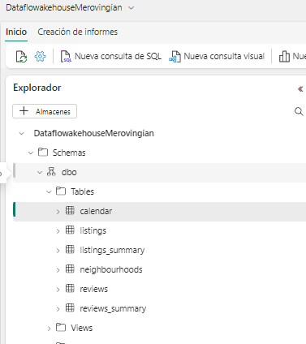
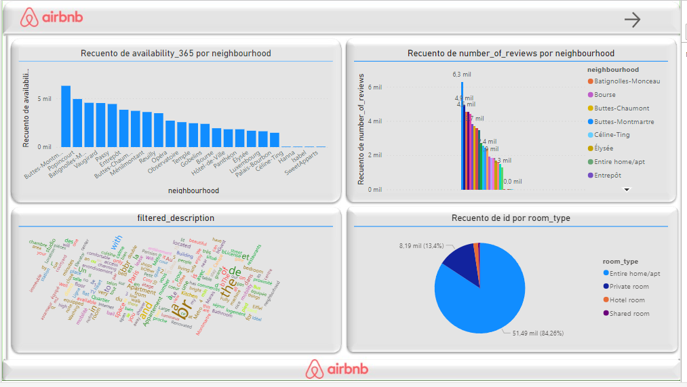
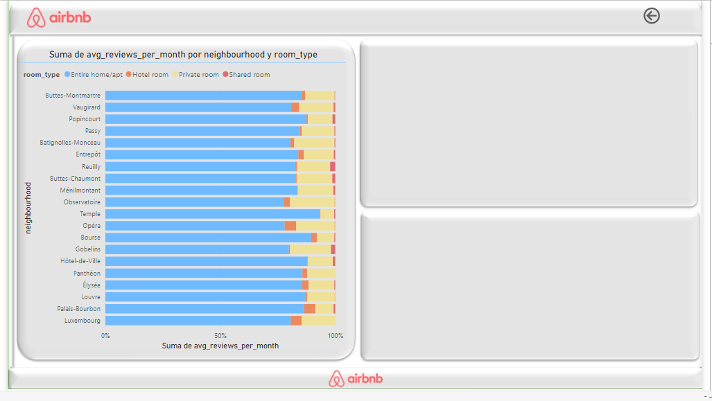

>Airbnb es la plataforma líder de alquiler de alojamientos del mundo. Habiendo comenzado 
sus operaciones en el año 2007, hoy ya cuenta con más de 4 millones de huéspedes, 6 
millones de alojamientos disponibles y ha sido usado por más de 150 millones de personas 
en más de 100,000 ciudades del mundo.

Para el siguiente ejercicio, buscaremos responder a ciertos interrogantes de negocio que 
podrían darse en las oficinas de Airbnb en París, y que serán respondidas por el equipo de 
Data Engineers y Data Scientists. 

Para esto, se incluyen los siguientes datasets:
#### listings.csv: 
incluye información de los alojamientos que existen en París, incluyendo 
su descripción, cantidad de habitaciones, precio por noche, entre otras variables.
#### listings_summary.csv: 
consiste en el mismo dataset de “summary.csv”, solo que con 
una menor cantidad de columnas.
#### reviews.csv:
incluye información de las reseñas que los usuarios dieron en la 
plataforma. Incluye la fecha en la que se escribió, el texto de la reseña, el nombre 
del usuario, entre otras variables.
#### reviews_summary.csv:
 consiste en el mismo dataset de “reviews.csv”, solo que con 
una menor cantidad de columnas.
#### neighbourhoods.geojson:
incluye el nombre de los distintos barrios que conforman la ciudad, además de un objeto que incluye un arreglo de las coordenadas que 
delimitan al barrio.
#### calendar.csv: 
incluye información a futuro de los días en el año para reservar cada 
alojamiento (es análogo al calendario que se observa en la página web al querer 
reservar un alojamiento). Incluye disponibilidad día a día, el precio para ese día, entre 
otros.
A partir de estos datasets, se busca responder a las siguientes pregunta
>
1) Dos ejecutivos de Airbnb están discutiendo respecto a cuáles son las zonas con más 
departamentos en Airbnb. Les ofreces hacer un análisis con buen nivel de detalle 
para enviarles un informe respecto a esto. Ellos dicen que no tienen tiempo de 
leerlo, que solo quieren ver una foto, imagen o tabla que les permita saberlo 
rápidamente. ¿Qué les muestras? (Desarrollar en código)
>
2) En otras ciudades del mundo, la gente está usando cada vez menos la aplicación. Al 
equipo ejecutivo en París le preocupa esto y quiere saber cómo es la situación en 
esa ciudad. Específicamente, le gustaría ver cómo fueron evolucionando la 
cantidad de reviews escritas a lo largo de los años.
>
3) El equipo de marketing está trabajando en una campaña global que consiste en 
mostrar cuáles son las principales palabras de viajeros asociadas a las principales 
ciudades del mundo. Les gustaría saber cuáles son las principales palabras que 
dicen de París (realiza la representación que prefieras para responder esta 
pregunta).
>
4) La inflación está haciendo estragos en Europa y al equipo ejecutivo le interesa saber 
cuál es la concepción de esto entre los propietarios de alojamientos. En otras 
palabras, les interesa saber si ya están teniendo en cuenta el aumento de precios a 
futuro en sus departamentos y existe una tendencia alcista en los precios que 
publican en Airbnb, o si no le están dando mayor importancia y los precios se ven 
bastante estáticos a futuro. La pregunta que escuchaste a un ejecutivo decir es: 
"¿Los inquilinos están planificando aumentar los precios?". (Siéntete libre de 
responderla de la forma que quieras, a partir de correr algún análisis estadístico, 
representación gráfica, etc. Para esta pregunta, puedes consultar el dataset
“calendar.csv” que incluye, para cada propiedad, el precio definido día a día para el 
próximo año).
>
5) En promedio, ¿cuál es el precio que paga una persona que se queda en un Airbnb?
>
6) El equipo de Marketing quiere hacerles un regalo a los mejores 10 anfitriónes de 
Airbnb en París. Te pide una lista de quienes son para hacerlo. ¿A quiénes elegirías 
para darle este regalo? ¿Por qué?
>
7) Por último: Crear una query SQL que devuelva: el precio promedio del mes de enero 
de 2023 de cada una de las propiedades ranqueadas por los 3 usuarios que más
reviews escribieron. Esta query también debe incluir el porcentaje de que tan 
disponible está este departamento durante ese mes. También se debe incluir el 
nombre del dueño de la propiedad (Debe ser una sola query. Deben ordenarse los 
resultados por “listing_id” en orden ascendente. Para este requerimiento, utilizar la 
librería "duckdb" de Python, que permite correr queries en SQL contra Dataframes 
de Pandas. Nota: las queries están en el dialecto del sistema SQLite).
El entregable del ejercicio debe consistir en un Jupyter Notebook que permita la ejecución 
secuencial de las celdas, adjuntando los datasets previamente mencionados en el mismo 
directorio que el archivo .ipynb. En caso de integrar data externa, adjuntar y especificar en 
qué consiste.

#### Proceso de Desarrollo en Microsoft Fabric
1. Creación de Data Warehouse
El proceso comienza con la configuración de un almacén de datos en Microsoft Fabric. Esto implica la definición de esquemas de datos, tablas y relaciones que serán fundamentales para almacenar y gestionar los datos de manera eficiente. La arquitectura del almacén se diseña para soportar consultas complejas y análisis de datos a gran escala.

2. Migración de Datos
Una vez establecido el data warehouse, se inicia un proceso de migración para transferir datos existentes al nuevo sistema. Este proceso incluye:

### Carga de Archivos:
 Los datos se extraen de diversas fuentes, como bases de datos operacionales o archivos externos.
### Transformación:
 Los datos se transforman para alinearlos con el esquema del almacén de datos. Esto puede incluir la normalización de formatos, la limpieza de datos y la resolución de inconsistencias.
### Carga en el Data Warehouse:
 Finalmente, los datos transformados se cargan en el almacén de datos.

El estado del proceso de migración se puede visualizar en la siguiente imagen:

### Tablas de Migración

Desarrollo de Vistas Temporales Dimensionales
Parte del proceso incluye el desarrollo de vistas dimensionales basadas en la tabla Echo Listings. Estas vistas permiten simplificar y agilizar el acceso a los datos para análisis específicos. Por ejemplo, se crean vistas para dimensiones como Host, Ubicación y Propiedades, facilitando así consultas analíticas y de reporting.

### Modelado ER
El modelo entidad-relación (ER) se desarrolla para representar las interacciones entre las entidades en el almacén de datos. Este modelo es crucial para entender la estructura del data warehouse y para guiar el desarrollo de consultas y aplicaciones que interactúan con la base de datos.

### Resumen
Este proceso integral asegura que el data warehouse en Microsoft Fabric no solo sea robusto y escalable, sino también adaptado a las necesidades específicas del análisis de datos. Con la ayuda de herramientas avanzadas y un enfoque sistemático para el diseño de bases de datos, Microsoft Fabric proporciona una plataforma potente para el manejo y análisis de grandes volúmenes de datos.

### Informe: 

